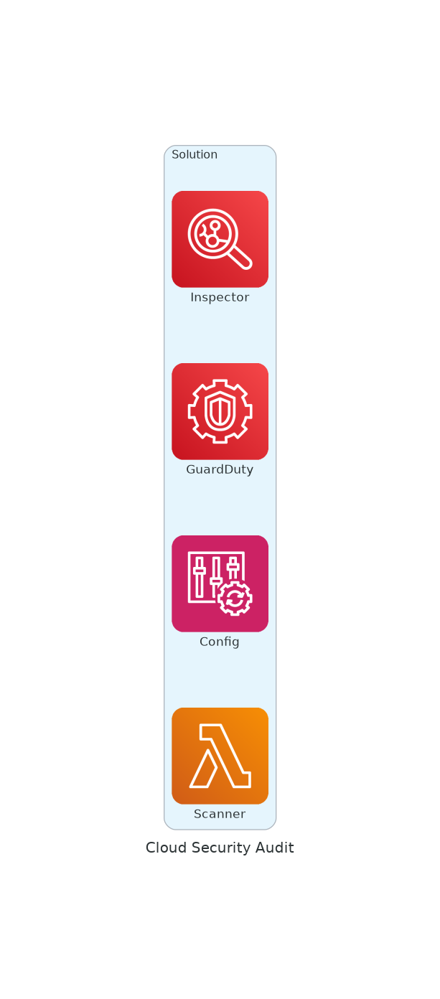

# ☁️ Cloud Security Audit Tools Collection

## Architecture



Comprehensive collection of 50+ open-source cloud security tools for AWS, GCP, Azure, Kubernetes, and containers.

## 📁 Structure

```
├── aws/                    # AWS-specific tools
├── azure/                  # Azure-specific tools  
├── gcp/                    # GCP-specific tools
├── kubernetes/             # Kubernetes security
├── container-security/     # Container scanning
├── iac-security/           # Infrastructure as Code
├── secrets-detection/      # Secret scanning
├── multi-cloud/            # Multi-cloud tools
├── pentesting/             # Cloud pentesting
└── docs/                   # Cheatsheets & resources
```

## 🛠️ Tools Included

### Multi-Cloud (`multi-cloud/`)
| Tool | Description |
|------|-------------|
| **Prowler** | AWS/GCP/Azure security assessments |
| **ScoutSuite** | Multi-cloud security auditing |
| **CloudSploit** | Cloud security configuration monitoring |
| **Cloud Custodian** | Rules engine for cloud management |
| **Steampipe** | SQL-based cloud queries |

### AWS (`aws/`)
| Tool | Description |
|------|-------------|
| **Pacu** | AWS exploitation framework |
| **Cloudsplaining** | IAM policy analysis |
| **PMapper** | IAM privilege escalation paths |
| **CloudMapper** | AWS environment visualization |
| **Stratus Red Team** | AWS attack simulation |
| **SkyArk** | Privileged entities discovery |
| **aws_consoler** | CLI to console URL converter |

### Azure (`azure/`)
| Tool | Description |
|------|-------------|
| **Azure-Audit** | Compliance audit scripts |
| **AzureInspect** | PowerShell audit tool |
| **Stormspotter** | Azure AD visualization |
| **ROADtools** | Azure AD exploration |
| **MicroBurst** | Azure security assessment |
| **PowerZure** | Azure exploitation toolkit |

### GCP (`gcp/`)
| Tool | Description |
|------|-------------|
| **GCP-Audit** | CIS Benchmark scripts |
| **GKE-Auditor** | GKE security auditing |
| **Gato** | GitHub Actions security |
| **GCPBucketBrute** | GCS bucket enumeration |

### Kubernetes (`kubernetes/`)
| Tool | Description |
|------|-------------|
| **Trivy** | Vulnerability scanner |
| **Kube-bench** | CIS Kubernetes Benchmark |
| **Kubescape** | Kubernetes security platform |
| **Falco** | Runtime security monitoring |
| **Kubesec** | Security risk analysis |
| **Kube-linter** | Static analysis for K8s |
| **Popeye** | Cluster resource sanitizer |

### Container Security (`container-security/`)
| Tool | Description |
|------|-------------|
| **Grype** | Vulnerability scanner |
| **Syft** | SBOM generator |
| **Dockle** | Container image linter |

### IaC Security (`iac-security/`)
| Tool | Description |
|------|-------------|
| **Checkov** | Static analysis for Terraform/CF/K8s |
| **KICS** | 2400+ queries for IaC |
| **Terrascan** | IaC compliance violations |
| **tfsec** | Terraform static analysis |

### Secrets Detection (`secrets-detection/`)
| Tool | Description |
|------|-------------|
| **TruffleHog** | Find leaked credentials |
| **Gitleaks** | Git secret scanning |

### Pentesting (`pentesting/`)
| Tool | Description |
|------|-------------|
| **PEASS-ng** | Privilege escalation scripts |
| **BloodHound** | AD attack path mapping |

### Documentation (`docs/`)
| Resource | Description |
|----------|-------------|
| **awesome-cloud-sec** | Curated cloud security list |
| **cloud-security-list** | Tools and vendors list |
| **CloudPentestCheatsheets** | Cloud pentest cheatsheets |
| **Awesome-Azure-Pentest** | Azure pentest resources |

## 🚀 Quick Start

### Install CLI Tools
```bash
# Multi-cloud
pip install prowler scoutsuite checkov cloudsplaining

# Kubernetes
brew install trivy kubescape kube-linter

# Container
brew install grype syft

# Secrets
brew install trufflehog gitleaks

# AWS
pip install pacu pmapper
```

### Run Scans

#### Cloud Providers
```bash
# AWS
prowler aws
scout aws
python PMapper/pmapper.py graph --create

# GCP  
prowler gcp --project-id PROJECT_ID
scout gcp --user-account

# Azure
prowler azure --subscription-id SUB_ID
scout azure --cli
```

#### Kubernetes
```bash
trivy k8s --report summary cluster
kubescape scan framework nsa
kube-bench run --targets master,node
popeye
```

#### IaC
```bash
checkov -d ./terraform
tfsec ./terraform
terrascan scan -d ./terraform
```

#### Containers
```bash
trivy image nginx:latest
grype nginx:latest
dockle nginx:latest
```

#### Secrets
```bash
trufflehog git file://./repo
gitleaks detect -s ./repo
```

## 📋 Prerequisites
- AWS: `aws configure`
- GCP: `gcloud auth login`  
- Azure: `az login`
- Kubernetes: `kubectl` configured

## 🔗 Quick Links
- [Prowler](https://github.com/prowler-cloud/prowler)
- [Darkmoon](https://github.com/ASCIT31/Dark-Moon) - Open source (GPLv3) autonomous penetration testing platform. 50 specialist agents over MCP, 80+ offensive tools, proof of exploitation on every finding, runs locally.
- [ScoutSuite](https://github.com/nccgroup/ScoutSuite)
- [Trivy](https://github.com/aquasecurity/trivy)
- [Checkov](https://github.com/bridgecrewio/checkov)
- [Kubescape](https://github.com/kubescape/kubescape)

## 📄 License
Each tool maintains its original license. See individual directories.

## 👤 Maintainer
[@vanhoangkha](https://github.com/vanhoangkha)
